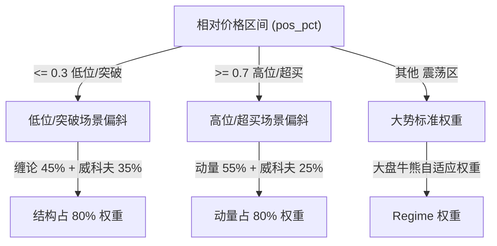

# Trader 2.4 — 架构文档（深挖参考）

> 最后更新：2026-07-30
> **注意**: AGENTS.md 是 Agent 快速参考，本文档用于开发调试/架构深挖。  
> T0 产品契约以 `docs/t0-strategy-v2.md` 为准（人读结构仪表盘；禁止「可执行/三重共振买」指令叙事）。

---

## 变更日志

### 2026-07-30 — 文档以代码为准同步 + 确认 bugfix

- **decision_view**：禁止新开时清零 `suggested_pct` / 仓位 cap
- **ATR trailing**：持仓票水位 `~/.trader/trailing_stop_watermark.json`（只紧不松；无仓不落）
- **买点盖价**：`mid.pullback_low` > `buy_zone_low` > support；**不用** `life_line` 当回踩下沿
- **T0 v2**：`today_action` 为人读结构文案；`position_size` 认 v2 + 旧枚举；风险状态含「数据异常/趋势下行暂不…」
- **Fusion**：默认 cards；失败 warning 后 classic；三席 chan/momentum/**vpf**
- 历史条目「T0 执行卡/三重共振」仅为变更史，**不再**描述当前产品输出

### 2026-07-20 — T0 执行卡 + Wyckoff Spring 弱分级 + 缠论 15m（历史）

- 当时引入执行卡/三重共振叙事；**已被 T0 v2 取代**（见 `docs/t0-strategy-v2.md`）
- **三重共振缠论升级**：缠论从纯 5m 升级为 15m 定方向 + 5m 定时机
- **VWAP 今日数据**：`today_bars()` 过滤跨日 bar
- **止盈方向拆分** / **缠论价格过滤** / **日线回溯扩至 120 根**
- **Wyckoff Spring 弱分级**：缩量无承接弱弹簧判定

### 2026-05-31 — 数据消费 Bug 修复 + 性能优化批次

共 5 个 commit，修复 12 个 bug，1 个性能优化：

- **性能：懒加载 fallback 依赖**（`light_data.py`）：mootdx/akshare/pytdx3 改为首次调用时才检测可用性，import 耗时 0.895s → 0.092s（10x），`build_report()` 总计 20s → 0.48s（42x）
- **修复：market_env.py 数据源错误**：`fetch_kline(scale="240")` 返回的是 Sina 分钟线而非日线，导致 MA/HMM 全部基于错误数据计算，缓存无限膨胀至 20700 条/3.2MB。改用 `fetch_qfq_daily(days=90)` 拉腾讯前复权日线，缓存增加按日期去重
- **修复：self_calibration.py 数据源不一致**：与 market_env 同样的 bug，离校准 regime 标签与线上不匹配。改用 `fetch_qfq_daily(days=250)`
- **修复：trade_date 解析错误**：`parse_trade_datetime()` 从后往前扫 `\d{8}` 时误匹配成交量（"10349555"），导致 trade_date = "1034-95-55"。改为优先从 fields[30] 提取腾讯 14 位时间戳
- **修复：market_env.py 运算符优先级**：`mid_weak and shrinking or mid_weak` 等价于 `(mid_weak and shrinking) or mid_weak`，mid_weak=True 时无条件判为"偏弱"。改为 `mid_weak and (shrinking or intraday_moderate)`
- **修复：t0_candidate_core.py 集合运算符**：`{"等转强", "冲高减仓"} | _DEFENSE_STATUSES` 位运算优先级混乱。改为 `{"等转强", "冲高减仓", *_DEFENSE_STATUSES}`
- **修复：monitor.py 未定义变量**：`_trigger_reason_lines()` 直接引用未定义的 `matched`，改为 `model.get("matched")`
- **修复：big_order.py 缺少 import warnings**：大单分析异常时 NameError 崩溃
- **修复：price_point_engine.py 布林带空 dict**：`max(bb.keys(), default=-1)` 空 dict 时返回 -1 导致价位丢失

### 2026-05-30 — Trader 2.4：三大技能整合 + 四阶段定位模型

- **技能整合**：6 个技能合并为 3 个——`trader`（单票分析 + 选股池）、`t0`（盘中盯盘）、`review`（盘后复盘 + 仓位轮动 + 信号追踪）
- **四阶段定位模型**：蓄势/蓄势偏强/蓄势偏弱/主升/派发/衰退 × 走强/修复/震荡/转弱，贯穿选股池入池三关、仓位轮动、盘后复盘全链路
- **分析引擎并行化**：多票分析场景下缠论/威科夫/筹码等模块并行执行，显著提升选股池批量分析速度
- **入池三关规则**：阶段匹配 + 基本面 + 技术面自动筛选
- **T0 输出精简**：从原有冗长格式精简为 4 部分（触发价 / 大单异动 / 操作建议 / 风控提醒）。后改为执行卡风格（结论→执行价→信号→失效→资金→降本）
- **仓位轮动四阶段逻辑**：根据四阶段定位动态调整仓位分配策略，不再单纯依赖评分排序

### 2026-05-23 — Trader 2.3：四大高级统计模块上线

新增四个纯 numpy 轻量级统计学模块，零重量级框架依赖：
- `hmm_regime.py` — 隐马尔可夫大势检测（Baum-Welch + Viterbi，3 隐状态）
- `bayesian_fusion.py` — 贝叶斯乘积规则多专家融合（默认关闭，BAYESIAN_FUSION=true 激活）
- `volume_profile.py` — 日内成交量分布，POC 控制节点与 70% Value Area
- `scripts/self_calibration.py` — 离线随机搜索参数校准，写入 ~/.trader/calibrated_params.json

测试体系扩展至 485 个用例（新增 3 个测试文件），全部通过零 Regression。

### 2026-05-23 — Trader 2.2：信号生命周期 V2 + 行情 HA + 融合优先级

- Signal Contract v2：SHA256 deterministic UUID，原子落盘，历史数据迁移工具
- MarketDataSourceController：1.5s TCP 超时熔断，30s 冷却隔离，自动 fallback 至腾讯/新浪
- 融合层场景优先级过滤器 + 置信冲突消解 + Regime 自适应参数缩放

### 2026-05-09 — Skill 结构优化：Commands/Output Contract 移至 references/

**目的：** 降低 SKILL.md 上下文占用，防止 LLM 幻觉生成错误命令或格式。

**变更内容：**
- 3 个 skill（trader, t0, review）
- SKILL.md 从 ~2100 词精简至 ~1200 词（↓43%）
- 每个 skill 新增 `references/` 目录，包含：
  - `commands.md` — 所有脚本命令（声明为"绝对真理"）
  - `output-template.md` — 输出结构模板（声明为"绝对真理"）
  - `output-style-guide.md` — 输出风格指南和旧输出检测清单（声明为"绝对真理"）
- 打包：`pack_all.py` 会自动将 `references/` 包含进 zip 包

### 2026-05-06 — 算法准确性审计

对核心算法指标模块逐行审计，修复 MACD 金叉/RSI 死代码/缠论分型检测/_calc_macd 副作用/DEA 初始化/中枢步长/一类买点/二类买点等 9 个问题。覆盖 momentum_core、chan_core、wyckoff_core、structure_core、decision_core、indicators.py、ict_execution.py。

---

## 二、数据架构（详细）

### 2.1 数据源

| 来源 | 接口 | 返回数据 | 用途 |
|------ | ------ | ------ | ------ |
| 腾讯行情 | `qt.gtimg.cn/q=` | 实时快照（现价/昨收/今开/涨跌/成交量/换手率） | 所有 skill 的现价/涨跌幅 |
| 腾讯日线 | `web.ifzq.gtimg.cn/appstock/app/fqkline/get` | 前复权日线，附加 `atr14/atr7/atr_ratio/tr` 字段 | 支撑阻力计算、状态判定 |
| 新浪 K 线 | `money.finance.sina.com.cn/quotes_service/api/...` | 5m / 15m / 30m 分钟线 | t0 盘中分析 |

### 2.2 light_data.py — 唯一数据入口与双源 HA 管道

`02-共享模块-shared/01-行情数据-market-data/light_data.py` 是所有 skill 的唯一数据拉取入口。在 Trader 2.2 中，该模块已全面重构为**双源热备高可用 (HA) 行情管道**。

#### 2.2.1 MarketDataSourceController 行情源控制器
系统使用独立的 `MarketDataSourceController` 来跟踪 mootdx TCP 行情接口的运行健康度：
* **秒级超时控制**：所有 mootdx 接口调用（如 bars / quotes）强制注入 `socket.setdefaulttimeout(1.5)` 限制，确保因网络阻塞引起的卡死在 1.5s 内强制熔断，防止导致盯盘/选股池任务发生静默离线挂起。
* **隔离冷却机制**：追踪连续失败次数。当 `consecutive_failures >= 3` 时，行情源判定为 `UNHEALTHY`，强制将其隔离并冷却冷却 `cooldown_seconds = 30` 秒。期间所有数据请求直接避开 mootdx 以节约查询开销。
* **静默秒切容灾**：当 mootdx 处于隔离冷却期或单次请求超时失败时，管道进行静默秒切降级：
  * **行情快照 (fetch_quote)**：自动 fallback 至腾讯 HTTP 行情 API。
  * **前复权日线 (fetch_qfq_daily)**：自动 fallback 至腾讯前复权日线接口。
  * **分钟线 (fetch_5m/15m/30m/kline)**：自动 fallback 至 Sina HTTP API，最后兜底 `akshare` (EastMoney API)。

#### 2.2.2 数据完备度标识 (`data_status`)
为保证下游策略对行情数据质量的知情权，`MarketSnapshot` 数据模型原生打上完备度标签：
* `"full"`：所有主行情源均正常返回完整数据（包含五档盘口）。
* `"partial"`：触发了 HTTP 行情源降级（例如 mootdx 挂掉，使用腾讯/akshare 行情），或者缺失了次要数据源（如 5m 分时缺失）。
* `"degraded"`：仅剩下快照或日线单方数据，策略精度降低。
* `"failed"`：完全无法获取数据。
* `missing_sources` 和 `source_errors` 用以记录具体失败源及其 Traceback，消除静默故障。

**核心函数：**

| 函数 | 作用 | 完备度标签影响 |
|------ | ------ | ------ |
| `fetch_quote()` | 腾讯实时行情快照 → `QuoteData` | 失败则降级 / 触发重试 |
| `fetch_qfq_daily()` | 腾讯前复权日线，追加 ATR 字段 | 失败则降级 / 触发重试 |
| `fetch_5m()` / `fetch_15m()` / `fetch_30m()` | 新浪分钟线 | 失败 fallback 至 akshare |
| `fetch_kline()` | 通用多周期 K 线拉取 + 归一化 | 失败 fallback 至 akshare |
| `load_market_snapshot()` | 聚合并拉取多源行情返回 `MarketSnapshot` | 自动标注 `data_status` |
| `resolve_security()` | 股票名/代码 → `Security(dataclass)` | 解析归一化证券代码 |
| `is_trading_time()` | 判断当前是否为交易日 9:30-15:00 | 过滤非交易时段 |

**数据模型层** `models.py` 定义统一 TypedDict：

| TypedDict | 用途 |
|------ | ------ |
| `BarData` | 统一 K 线数据行（跨周期） |
| `QuoteData` | 实时行情快照 |
| `MAValues` | 多周期均线集合 |
| `CandidateLevels` | 候选交易区间（支撑/阻力/止损/止盈/确认价） |
| `CandidateSignal` | 候选信号核心结构 |
| `TheoryVerdict` | 复盘五层理论打分 |
| `SignalRecord` | Signal Contract v1 记录 |
| `ChanlunSignal` | 缠论分析结果 |
| `WyckoffSignal` | 威科夫信号 |

**HTTP 客户端** `HttpClient`：GET with User-Agent、gzip、SSL-unverified。 `retry()` 指数退避 3 次。
**缓存**：bars 不含当日日期时缓存 1 小时，实时数据不缓存，行情快照进行 30s TTL 缓存。
**NAME_MAP**：10 个常用股票名到代码的映射（南网科技→688248、中国铝业→601600、中证1000→000852 等）。

#### 2.2.3 懒加载 Fallback 依赖（2026-05-31 修复）

`light_data.py` 的三个 fallback 库（mootdx、akshare、pytdx3）改为**懒加载**：import 时不加载，首次调用时才检测可用性。原因是这三个库实际从未被调用（主数据源是腾讯 HTTP API），但 import 时同步加载浪费 ~0.8s。

- `_check_mootdx()` / `_check_akshare()` / `_check_pytdx3()` — 懒加载检测函数
- `_MOOTDX_AVAILABLE` / `_AKSHARE_AVAILABLE` / `_TDX3_AVAILABLE` — 三态布尔（None=未检测, True/False=已检测）
- 所有引用 `_MOOTDX_AVAILABLE` 等变量的地方改为调用对应的 `_check_*()` 函数
- import 耗时：0.895s → 0.092s（10x 提升）

#### 2.2.4 parse_trade_datetime 解析逻辑（2026-05-31 修复）

腾讯行情 `fields[30]` 存储 14 位时间戳（如 "20260529161443"），解析优先级：

1. **优先**：从 `fields[30]` 提取 14 位时间戳 → `trade_date=2026-05-29`, `trade_time=16:14:43`
2. **兜底**：从后往前扫描 `YYYY-MM-DD` 和 `HH:MM:SS` 格式

旧逻辑从后往前扫 `\d{8}`，会误匹配成交量（fields[36] = "10349555"）导致 `trade_date = "1034-95-55"`。

### 2.3 状态机（`config.py STATUS_SCORE` + `decision_core.status_layers()`）

> 单票分析以 `base_status` + `theory_status` 为主，`state_label` 只是展示/兼容层。
> 核心函数已从 `status_for()` 升级为 `status_layers()`，返回 dict 而非 str。

**STATUS_SCORE 完整列表（config.py + decision_core.py 扩展）：**

> **注意**：STATUS_SCORE 在 `config.py` 中定义基础值，`decision_core.py` 中通过直接赋值覆盖（同值重申）并额外新增了"防守观察，趋势下行谨慎"条目。两处定义值保持同步，以 `decision_core.py` 的运行时值为准。

| 状态 | score | 触发条件 | 典型场景 |
|------ | ------ | ------ | ------ |
| **暂不碰** | 20 | 现价跌破硬止损 / 年线下方警告 | 破位下行，防守优先 |
| **低吸观察** | 80 | 现价在低吸区附近，未破止损 | 缩量回调用至支撑区 |
| **冲高减仓** | 55 | 现价靠近确认价/压力区，上涨乏力 | 反弹触压，减仓信号 |
| **等转强** | 70 | 现价在支撑之上但距确认价有空间 | 止跌后等待确认突破 |
| **防守观察** | 60 | 现价靠近支撑但未确认止跌 / 假跌破 | 支撑附近观望 |
| **防守观察，趋势下行谨慎** | 50 | 现价靠近防守位且趋势朝下 / 多次破均线 | 弱势行情中防守观察的加强版 |
| **空间不足** | 30 | 距确认价空间过小，盈亏比不够 | 高位震荡，无明确方向 |
| **数据失败** | 0 | K 线数据不足 60 根 | 新股/停牌复牌 |
| **突破确认** | 85 | 理论突破确认（3日验证） | 缠论三买/威科夫突破 |
| **突破观察** | 75 | 突破待确认 | 突破后观察量能 |
| **体系转强确认** | 88 | 多维理论共振转强 | 缠论+威科夫+动量共振 |
| **未确认转强** | 72 | 转强信号未确认 | 信号初现待验证 |
| **转强不足** | 62 | 转强力度不够 | 假突破回落 |
| **承接存在** | 68 | 下方有承接力（`below_ma_count >= 3`） | 支撑区有买盘 |
| **修复观察** | 65 | 均线/结构修复中 | 下跌后企稳修复 |
| **空间偏紧** | — | 操作空间过窄 | 高位窄幅震荡（兼容状态，不在 STATUS_SCORE 中） |

### 2.4 状态判定优先级

`status_layers()` 判定顺序:
1. `_ma250_check()` — 年线下方标记警告 `ma250_warning=True`，不再一票否决
2. 融合层覆盖（`FUSION_OVERRIDE_ENABLED` + 置信度阈值）
3. 假跌破确认（`_fake_break`）
4. 分阶段退出（`_near_stop`）
5. 原有状态级联：暂不碰 > 低吸观察 > 冲高减仓/等转强 > 空间不足 > 防守观察

**返回值格式：**
```python
{
    "base_status": str,          # 基础状态（结构位置层）
    "theory_status": str,        # 理论结论层
    "status": str,               # 兼容旧接口，当前等于 theory_status
    "fusion_override_used": bool,# 是否触发了融合层覆盖
    "trend_ok": bool,            # 短期均线是否在长期均线上方
    "change": float,             # 当日涨跌幅
    "below_ma_count": int,       # 低于 MA5/MA10/MA20 的均线数
    "above_ma5_ma10": bool,      # 现价是否在 MA5 和 MA10 上方
    "pressure_space_pct": float, # 距压力位的空间百分比
    "ma250_warning": bool,       # 是否在年线下方（警告）
    "ma250": float,              # 250日均线值
}
```

> **注意**：`trailing_stop`（移动止损价）不在 `status_layers()` 返回中，它由 `structure_core.py` 的 `build_structure_context()` 返回（字段名 `trailing_stop`）。  
> **只紧不松**：可选 `prev_trailing_stop`；**持仓票**（cost>0）按 `trailing_ratchet_symbol` 读写 `~/.trader/trailing_stop_watermark.json`；无仓不落水位（避免无仓误抬止损）。

---

## 三、Skill 职责详情

### 3.1 trader（单票分析 + 选股池）

**入口**: `scripts/final_report.py`（单票分析）/ `scripts/final_pool.py`（选股池薄 CLI）
**分析模型**: `report_builder.build_report()`（`run_analysis` 薄壳 re-export）→ `report_pipeline/` 各 stage → `report_core.render_single`（默认 `render_short_midline`）→ 可选 `build_signal()`
**策略链**: 日线专家并行 → fusion（cards）→ structure → 周线 mid 引擎（`mid_key_prices` / midline 理论）→ `mistery_gate` + `chan_discipline` → `merge_discipline` → `conclusion_block` → 渲染
**选股池实现**: `scripts/pool_cmds/`（`scoring` / `add` / `plan_view` / `rank_view` / …）；**勿**把逻辑写回 `final_pool.py`
**输入数据**: 腾讯日线（前复权 + ATR，默认 `LOOKBACK_DAYS=370`）+ 实时快照；周线默认 `WEEKLY_LOOKBACK_BARS=260`（中线缠论/威科夫/中线关键价）
**依赖共享模块**: `report_builder`、`report_pipeline`、`light_data`、`data_provider`、`chan_core`、`wyckoff_core`、`mid_key_prices`、`midline_structure`、`chan_discipline`、`mistery_gate`、`conclusion_block`、`report_core`、`fusion_core`

**周线 / 波段标签契约（2026-07-16）**:
- 默认拉 260 根周 K；旧 80 周在暴涨票上易假「笔数不足」
- `wave_label`：仅 `strokes < 3` →「笔数不足」；段少 →「线段偏少/未成型」+ 笔级叙事
- MACD 预热 `None` 禁止 `0.0` 占位（背驰面积）

**Output Contract（始终中短线双轨；`SHORT_MIDLINE_REPORT=false` 已忽略）**:
```
分析报告 — {name}（{code}）｜短中线
现价 + 动能｜大盘 + MA5/MA20/MA250 + 量比/换手
🧭 中线 → 阶段 + 看法 + 周线威科夫/缠论 + 位置 + 关键价（生命线/回踩/压力/目标）
⚡ 短线 → 看法 + 日线缠/动能 + 共振 + 新开(C1) + 动作/原因/破位 + 关键价（止损/买点/🌟/卖点）
说明（可选冲突）→ ✅ 亮点 → ⚠️ 风险 → 📌 本周只做 → T0 → 入池提示
```
出手听 `decision_view`（共振∧策略∧纪律）；禁止新开时 `suggested_pct`/仓位 cap 归零。  
契约全文：`01-功能包-packages/trader/references/output-template.md`。

**选股池命令集**: `analyze` `add` `add-pending` `confirm-to-pool` `show` `show-pending` `rank` `plan` `review` `remove` `archive-exited`

**入池三关规则**（实现：`pool_cmds/scoring.py`）:
- 第一关：阶段筛选（衰退 → 拒绝）
- 第二关：结构评分门槛（按 `major_stage` 查 `ADMISSION_SCORE_*`）
  - 缠论子分（max 45）+ 威科夫（max 30）+ 筹码（max 25）+ 动量（max 20）→ `total_score`（封顶 100）
  - **`fusion_score`（-20~+20）仅仪表**：不进总分、不抬/压入池门槛、不参与排序
  - 共振档离散收紧：冲突 / 动能拆台时「执行」→「观察」
- 第三关：风控（现价 ≤ 止损 → 拒绝；触发/防守位不清 → 待补）

### 3.2 t0（盘中结构参考卡）

**入口**: `01-功能包-packages/t0/scripts/final_t0.py`（包内 `t0_*.py` / `monitor.py` 等为 identity shim）
**引擎（改这里）**: `trader_shared/t0_run.py` / `t0_core.py` / `t0_monitor.py` / `t0_price_point_engine.py` / `t0_indicators.py` / `t0_ict_execution.py` / `t0_config.py`
**输入数据**: 腾讯实时快照 + 新浪 5m/15m/30m K线
**产品法源**: `docs/t0-strategy-v2.md` — **人读结构仪表盘**，禁止「可执行 / 可低吸 / 三重共振买」指令叙事

**Monitor Mode**: 轮询 → `detect_state_change()` → cooldown → 告警文本 + 追加 `signals.jsonl`。单次 `--once` 适合 cron。

**T0 结构参考卡 v2（现行）**：
标题 → 结构结论（位置/强弱 · 人决策）→ `📌 结构`（关注价，非下单）→ `🔗 参考`（评分仅参考）→ 看法失效 → 资金 → 有持仓才降本。
- VWAP 只用今日 session（`session_5m_bars` / 当日过滤，避免跨日污染）
- 数据长度：日线 120 / 5m 800（及配置约定的 15m 等）
- 机械 5m 信号回测已收工，不进自动执行
- 契约模板：`01-功能包-packages/t0/references/output-template.md`

### 3.3 review（盘后复盘 + 仓位轮动 + 信号追踪）

**入口**: `scripts/final_review.py` / `scripts/final_portfolio.py` / `scripts/final_tracker.py`（包内引擎文件多为 shim）
**引擎（改这里）**: `trader_shared/review_core.py` / `review_render.py` / `portfolio_core.py` / `portfolio_run.py`；包内可保留 `review_model.py` / `candidate_model.py` 等薄适配

**五层理论分析** (`theory_verdicts()`):

| 层级 | 范围 | TypedDict 字段 |
|------ | ------ | ------ |
| 缠论结构 | 0-100 | `chandelier` |
| 威科夫量价 | 0-100 | `wyckoff` |
| 筹码峰 | 0-100 | `chips` |
| 资金行为 | 0-100 | `money` |
| 动能确认 | 0-100 | 在 `scores["momentum"]` 中返回（未纳入 `TheoryVerdict` TypedDict） |

**仓位轮动四阶段逻辑**: 根据四阶段定位（蓄势/蓄势偏强/蓄势偏弱/主升/派发/衰退 × 走强/修复/震荡/转弱）动态调整仓位分配策略，不再单纯依赖评分排序。

**信号追踪**: 以 `~/.trader/signals.jsonl` 为主事件流；结算/准确率面板可读配套结果文件（若存在 `signal_results.jsonl`）

### 3.4 wyckoff（威科夫结构卡 + 池链排序）

**入口**: `01-功能包-packages/wyckoff/scripts/final_wyckoff.py`（`--target` / `rank`；包内 `wyckoff_*.py` 为 identity shim）  
**引擎（改这里）**: `trader_shared/wyckoff_run.py` / `wyckoff_render.py` / `wyckoff_chain.py`；检测仍走 `wyckoff_core` / 出口走 `wyckoff_view`  
**产品定位**: 人读结构参考卡；**不作**交易总司令；池 `rank` 仅吸筹链视角，不改 trader 分道  
**数据**: `light_data.load_market_snapshot`（日+周，无 5m/tick）；池排序读 `~/.trader/pool.json` 缓存字段  

---

## 四、依赖拓扑图

```
                    +- 02-共享模块-shared/
                    |-- 01-行情数据-market-data/    ← 仅存 re-export 存根
                    |    light_data.py (9行存根 → trader_shared)
                    |-- 02-候选逻辑-candidate/     ← 仅存 re-export 存根
                    |    candidate_core.py (9行存根 → trader_shared)
                    |-- 03-输出校验-contracts/     ← 空目录（仅 .gitkeep）
                    |-- scripts/
                    |    calibrator.py (回测校准)
                    |    market_env.py (大盘环境)
                    |    pipeline.py (状态管道)
                    |    signal_tracker.py (信号追踪)
                    |    self_calibration.py (离线参数校准)
                    |    signal_migration_tool.py (信号迁移)
                    |-- trader_shared/             ← P6: 标准 Python 包（实际代码所在）
                    |    __init__.py (lazy-load 路由)
                    |    config.py (全系统常量集中管理)
                    |    light_data.py (数据拉取 + HTTP + HA双源)
                    |    models.py (TypedDict 统一模型)
                    |    decision_core.py (状态判定 + status_layers)
                    |    structure_core.py (支撑/阻力 + 移动止损)
                    |    fusion_core.py (决策融合层)
                    |    fusion_regime.py (权重矩阵)
                    |    chan_core.py (缠论: 分型/笔/中枢/买卖点)
                    |    wyckoff_core.py (威科夫: Spring/Upthrust)
                    |    momentum_core.py (动量策略)
                    |    volume_profile.py (日内成交量分布)
                    |    bayesian_fusion.py (贝叶斯融合)
                    |    hmm_regime.py (HMM 大势检测)
                    |    chip_distribution.py (筹码分布)
                    |    signal_contract.py (v1 校验)
                    |    signal_store.py (JSONL 持久化)
                    |    signal_utils.py (UUID 生成/归一化)
                    |    schema/v1.py (P7: 输出契约规则库)
                    |    data_provider.py (P8: 可插拔数据接口)
                    +--------------------------+
                              ^ sys.path.insert(3 parents up)
                    +- 各 skill scripts/*.py
                    +--------------------------+
```

所有 skill 通过 `ROOT = Path(__file__).resolve().parents[3]` 向上定位共享模块，再用 `sys.path.insert()`。

---

## 五、分析模型层（详细）

### 5.1 candidate_core.py

**注意**：`candidate_core.py` 是一个薄 re-export 存根（仅 9 行），实际实现分布在：
- `structure_core.py`：`build_structure_context()`、`_theory_multipliers()`
- `decision_core.py`：`status_for()`、`status_layers()`、`score_for()`、`base_weight()`、`atr_volatility_level()`、`atr_stop_buffer()`

**常量配置** 全部集中在 `trader_shared/config.py`，per-skill `config.py` 可覆盖。

**核心函数（实际实现位置）：**
| 函数 | 实现文件 | 参数 | 返回值 |
|------ | ------ | ------ | ------ |
| `build_structure_context()` | structure_core.py | current, bars, change_pct=None, quote=None, fusion_result=None, chan_result=None, fetcher=None, pnl_pct=None, vp_result=None | dict[str, Any] |
| `status_for()` | decision_core.py | 价格/支撑/确认价/止损等 + MA + 压力空间 | str 状态 |
| `score_for()` | decision_core.py | status + 现价+支撑+空间+MA+ATR dict | float 0-100 |
| `base_weight()` | decision_core.py | atr_level str | int % |
| `atr_volatility_level()` | decision_core.py | atr_ratio | (level_str, cap_pct) |
| `atr_stop_buffer()` | decision_core.py | atr_ratio, atr14 | (distance, text) |

### 5.2 缠论分析 (`chan_core.py`)

`handle_inclusion()` / `find_fractions()` / `build_strokes()` / `build_zones()` / `detect_buy_points()` / `detect_divergence()` / `_check_macd_for_2nd_buy()`

**二类买点过滤规则（2026-06-04 修复）：**
- 需通过 `_check_macd_for_2nd_buy()` MACD 确认：底背驰（条件A）或止跌信号（条件B）
- 空头排列过滤：最近5根K线收盘价均低于 MA5/MA10/MA20 则拒绝标记二类买
- MA 计算已修复为跨窗口比较（非同窗口）

### 5.3 威科夫分析 (`wyckoff_core.py` + `wyckoff_view.py`)

主入口：`wyckoff_analysis()` / `wyckoff_strategy()` / `wyckoff_strategy_midline()` / `calculate_wyckoff_score()` / `format_wyckoff_oneline()`。

**统一出口 View（A 档，2026-07-17）**：
- `to_wyckoff_state_view(analysis)` → `WyckoffStateView`（`trader_shared/wyckoff_view.py`）
- 契约：`docs/designs/wyckoff-state-view.md`
- 薄适配既有 analysis，**不重跑** events/phase；生产报告主路径仍可直接读旧 dict
- Agent / 复盘 / 后续迁移：**优先读 View**（phase、active_events、bias、summary_oneline…）

**消费面（2026-07 对齐）**：
- 短线 fusion 第三席是 **VPF**，威科夫**不进** `merge_decisions` 加权（`_wyckoff_to_signal` 仅兼容/测试）。
- 池/复盘：`calculate_wyckoff_score`（含事件簇、premature 降权、TR 质量）。
- 中线报告：`wyckoff_strategy_midline` 周线独占；不足 → `timeframe=insufficient` → oneline「周线不足 · 不参与定论」。
- 孤立信号：`spring_premature` / `upthrust_premature` 打分减半；oneline 中性+噪声说明；`wyckoff_midline_bias` 不抬 strong_*。

检测器：`_detect_spring`（ATR 刺穿，与 ST 共用 `_spring_breach_level`；弱分级：`vol_ratio < WYCKOFF_SPRING_LOW_VOL_RATIO` → weak，不再用 depth_pct 判定弱弹簧）/ `_detect_upthrust` / `_detect_buying_climax`（高位过滤 `WYCKOFF_BC_MIN_POS_PCT`）/ `_detect_sign_of_weakness` / `_detect_ar` / `_detect_sos` / `_detect_st` / `_detect_lps` / 量价背离 / VSA / phase 状态机（phase ≠ major_stage）。

报告展示：`format_wyckoff_oneline()` 输出单行白话，例如  
`威科夫：低位假跌破后收回 · 偏多（更像洗盘，缩量较可信）`；无事件 `威科夫：暂无事件 · 中性`；周线不足 `威科夫：周线不足 · 不参与定论`。

### 5.4 动量策略 (`momentum_core.py`)

`calc_rsi()` / `calc_macd()` / `calc_adx()` / `calc_bollinger()` / `assess_momentum()`

### 5.5 智能决策融合层 (`fusion_core.py` / `fusion_regime.py`)

决策融合层是贯穿结构、缠论、动量与威科夫等多维分析体系的”终极裁判”。在传统多指标决策中，多头信号与空头冲突往往会导致系统输出”数据冲突”或者”中性旁观”等平庸判定。Trader 2.2 通过智能决策融合层彻底打破了这一桎梏。

**`merge_decisions()` 当前签名（12 参数）：**
```python
def merge_decisions(
    chan_result, momentum_result, wyckoff_result,
    regime="正常", current_price=0.0, bars=None,
    hmm_regime="range", extend_fundamental=None, extend_sentiment=None,
    main_force_env=None, data_status="full", fetcher=None,
) -> dict
```

> 相比于前文记载的 9 参数版本，实际代码新增了 3 个参数：`main_force_env`（主力行为阶段权重修正）、`data_status`（数据完备度降级拦截）、`fetcher`（可注入数据源 DI）。

#### 5.5.1 信号标准化抽象
融合层首先将底层各个策略子系统的原始计算结果抽象为带有方向与置信度的统一信号包（`CandidateSignal`）：
* **缠论转换**：根据（一/二/三类买点 > 底背驰 > 顶背驰 > 趋势段）优先级映射。一类买点（底背驰极值点）置信度 0.8，二类买点置信度 0.4（需 MACD 确认），趋势拉升段置信度 0.4。
* **动量转换**：使用独特的 **U 型置信度映射函数**。动量指标分值接近两端（极度超买/超卖，$\le 25$ 或 $\ge 75$）时置信度激增为 0.8，处于 41-59 震荡灰区时置信度跌至 0.2。
* **第三席 VPF（价量资金）**：短线加权用 `vpf`，**不是**威科夫。`_wyckoff_to_signal` 仍保留优先级映射供兼容/测试（Spring→SOS→UT→BC→SOW→…），但不被 `merge_decisions` 调用。

#### 5.5.2 场景优先级过滤器 (Scenario Priority Filter)
融合层摒弃了静态等权（Equal Weighting）模式，通过计算股价在 20 日高低区间的相对价格位置（$pos\_pct$），实行动态权重倾斜：
* **筑底/突破区间（$pos\_pct \le 0.3$ 或强结构买点）**：将 **80% 的决策权重分配给结构化理论（缠论 45% + 威科夫 35%）**，动量权重压缩至 20%。以此消除低位筑底时动量指标金叉/死叉频繁交织产生的磨损，强力捕捉“Spring 弹簧低吸位”或“缠论三买突破位”。
* **冲顶/超买区间（$pos\_pct \ge 0.7$ 或强结构卖点/高动量）**：将 **80% 的决策权重分配给动量与威科夫量价（动量 55% + 威科夫 25%）**，缠论权重压缩至 20%。用来在情绪高潮期通过动量极值和威科夫上冲回落拦截假突破，预防高位套牢。
* **震荡区间**：退化为基于宏观大势的标准权重。


```mermaid
graph TD
    Price["相对价格区间 (pos_pct)"] -->|<= 0.3 低位/突破| Breakout["低位/突破场景偏斜"]
    Price -->|>= 0.7 高位/超买| Climax["高位/超买场景偏斜"]
    Price -->|其他 震荡区| Standard["大势标准权重"]

    Breakout -->|缠论 45% + 威科夫 35%| Output1["结构占 80% 权重"]
    Climax -->|动量 55% + 威科夫 25%| Output2["动量占 80% 权重"]
    Standard -->|大盘牛熊自适应权重| Output3["Regime 权重"]
```

#### 5.5.3 冲突消解与 Veto 噪点消减机制
当各维理论出现强分歧时（$disagreement = max(dir) - min(dir) > 1$，如 1 与 -1 并存），融合层启动置信度优先级覆盖逻辑：
* **低位转强 Veto 覆盖**：若底层触发了缠论结构买点或威科夫 Spring 看多信号，直接将动量指标的看空噪点归零（$direction = 0$）。
* **高位筑顶 Veto 覆盖**：若底层触发了缠论顶背驰或威科夫上冲回落（Upthrust）看空信号，直接将动量指标的冲高看多噪点归零。
* **分歧解耦**：当发生 Veto 噪声消除时，系统将用于诊断的原始分歧度 `disagreement` 与用于映射决策逻辑的 `disagreement_for_action` 进行解耦，并强制令 `disagreement_for_action = 0`，消除传统策略在强底分型转强突破时被冲突误判拦截的隐患。

### 5.6 大势参数自适应调节器 (Regime Multipliers)

在单票分析的价格计算层（`structure_core.py`），系统不再使用静态硬编码的安全缓冲，而是引入了与大盘宏观牛熊环境（`market_env`）及理论融合结果深度挂钩的自适应调节器：

#### 5.6.1 Regime 参数微调公式
系统通过 `_theory_multipliers` 计算 4 个维度的动态调节系数：

1. **大势缩放 (Regime Factor)**：
   * **偏弱/很差大势**：自动收窄止损缓冲距离（`stop_buffer` = 0.8x），防止单票在弱势行情中阴跌扛单；同时加宽突破确认确认门槛（`confirm_buffer` = 1.3x），规避弱势行情中频发的假突破。
   * **正常大势**：积极拓宽低吸区宽度（`zone_width` = 1.2x），避免低吸区过窄导致强势股踏空；同时收紧突破确认价（`confirm_buffer` = 0.8x），提升在健康市场中的突破敏感度。

2. **理论微调 (Theory Finetuning)**：
   * 触发缠论强势上攻段或三买信号时：`zone_width` 额外放大 1.15x（拓宽低吸吸纳容错）。
   * 触发缠论回调或顶背驰时：`zone_width` 额外压缩 0.90x（紧贴防守线）。
   * 触发威科夫 Spring 弹簧或看多量价背离时：`confirm_buffer` 额外收紧 0.70x（大幅提高对低吸确认的可达性）。
   * 动量强势（bullish + $\ge 65$）时：`space_threshold`（空间不足过滤门槛）缩窄 0.80x（激进买入）。
   * 动量弱势（bearish + $\le 35$）时：`space_threshold` 放大 1.30x（保守防守）。

#### 5.6.2 动态价格闭环
以上 4 维系数完美嵌入 `build_structure_context()`，使得算出来的低吸区上/下沿、止损线、确认价及突破过滤阈值均具备全天候数学鲁棒性，彻底打通了大势-多维理论-单票决策的数据闭环。

---

## 六、Signal Contract 协议层与信号生命周期 V2

### 6.1 Signal Record v1

版本 `trader_signal_v1`，验证器 242 行。

**必须字段摘要：**

| 字段 | 类型 | 允许值 |
|------ | ------ | ------ |
| `contract` | string | `trader_signal_v1` |
| `source_skill` | string | trader / t0 / review |
| `symbol` | string | `688248.SH` |
| `signal_type` | string | 常用类型：observe / low_buy_watch / low_buy_triggered / high_sell_triggered / reduce / defensive / risk_stop / trigger_expired / blocked / review_result。完整列表约 25 种（含 add_position / reduce_position / hold_observe / defensive_watch / wait_for_strength / hold / chase_rally / divergence_entry / completed_5m_confirm / price_confirm / watch_price / price_break / stop_loss / low_sell_triggered / low_sell_watch / wait_for_confirmation / track / high_sell_watch 等），详见 `trader_shared/signal_contract.py:74-104` |
| `direction` | string | bullish / bearish / neutral / bullish_lean / bearish_lean |
| `action` | string | no_action / observe / wait / track / low_buy / high_sell / reduce / stop_low_buy / stop_high_sell / pilot_entry |
| `confidence` | string | low / medium / high |
| `position` | dict | max_total_pct + max_single_move_pct |

### 6.2 信号写入

| Skill | 写入时机 | signal_type 示例 |
|------ | ------ | ------ |
| `trader` | `--output signal-json` | `observe` / `reduce` |
| `t0` | monitor mode 状态变化 | `low_buy_watch` → `low_buy_triggered` |
| `review` | 盘后复盘完成 | `review_result` |

### 6.3 Signal Tag 展示约定

| signal_type | Tag |
|------ | ------ |
| `low_buy_triggered` | 🟢T0低吸 |
| `high_sell_triggered` | 🔴T0高抛 |
| `risk_stop` | ⚠️T0止损 |
| `track` / `low_buy_watch` | 👁跟踪 |
| `reduce` | 📉减仓 |

### 6.4 信号生命周期 V2 与 UUID 强一致去重 (Signal Lifecycle V2)

在 Trader 2.2 中，为了杜绝由于跨组件时区偏差、多进程并发写入、以及大盘跳空等各种边缘场景引起的信号重复生成或冗余结算，引入了严密的信号生命周期 V2 去重防重架构。

#### 6.4.1 normalize_signal_id 统一 UUID 生成算法
UUID 生成规则基于强一致的 deterministic SHA256 算法。规范函数名为 `normalize_signal_id()`（位于 `trader_shared/signal_utils.py`），`signal_tracker.py` 中保留 `make_signal_id()` 作为兼容包装。算法针对 4 个核心业务要素进行归一化后计算哈希值：
1. **证券代码归一化 (`_normalize_symbol`)**：支持 `688248.SH`、`SH688248`、`688248` 等各种杂乱输入，统一映射为带点后缀标准格式 `CODE.MARKET` 并大写。
2. **交易日期归一化 (`_norm_date`)**：将 `2025/5/2`、`20250502`、`2025-05-02T14:30:00` 等日期形式统一转换为零填充的 `YYYY-MM-DD` 格式。
3. **信号类型归一化 (`_normalize_signal_type`)**：自动将各类旧版中文状态名（如"低吸观察"）或非标准缩写映射为 v1 英文标准字段（如 `low_buy_watch`）。
4. **触发价格归一化 (`_safe_price` & `f"{price:.2f}"`)**：无论是数值型还是内嵌字典类型中的价格信息，统一提取并格式化为标准双精度字符串。

哈希计算公式：
$$\text{UUID} = \text{SHA256}(\text{normalized\_symbol} \parallel \text{normalized\_date} \parallel \text{normalized\_type} \parallel \text{price\_2decimals}) \text{[:16]}$$
返回 16 位确定性 Hex 字符（48 bit 熵），全局唯一，不随环境时区或系统时间改变。

#### 6.4.2 严格 UUID 双向去重与防重结算
* **加载/检索拦截 (Deduplication)**：在 `check_recent()`、`backfill()` 以及 `log_safe()` 等核心信号读写节点，系统在加载和保存信号时会自动根据新 UUID (及旧 `signal_id_md5` 兼容字段) 在已存在缓存中进行双向检测。只要 UUID 重合，直接幂等丢弃，杜绝二次充填。
* **状态机转换卫语句**：信号状态划分为 `active` (活跃)、`completed` (已结算)、`expired` (已过期)。注册 `_FORBIDDEN_TRANSITIONS` 状态转换黑名单，禁止将已完成/已过期的信号逆向激活。

#### 6.4.3 原子临时写与 fsync 落盘安全
为彻底规避系统崩溃或中断造成的 JSONL 写入残缺甚至文件损坏（Corruption），所有信号持久化变更 (`fill`、`fill_by_target`) 均遵循严密的落盘原则：
1. 先向临时文件 `*.jsonl.tmp` 写入完整序列化内容。
2. 调用 `os.fsync(fd)` 强制操作系统硬件将缓冲区数据刷新落盘。
3. 通过操作系统原子指令 `os.replace()` 替代原始文件，保证文件写操作的绝对完整与强事务级安全。

#### 6.4.4 信号平滑迁移工具 (`signal_migration_tool.py`)
为实现平滑升级，Trader 2.2 提供了一键历史老数据迁移脚本。该 CLI 工具能够自动检索用户根目录 `~/.trader/` 下的 `signals.jsonl` 与 `signal_results.jsonl`，将旧有 MD5 短哈希无损升级为新版 UUID 长 Hex 标识并清理重复记录，保证历史准确率数据无缝流转至新系统。

---

## 七、输出契约与校验（详细）

### 7.1 通用输出格式约束

- `#` 标题 → 禁用
- `---` / `***` 水平线 → 禁用
- `**` 粗体 → 禁用
- `|...|` 表格 → 禁用
- 首行必须以固定 emoji 开头

### 7.2 禁止词清单

| 类别 | 禁止词 |
|------ | ------ |
| 确定性预测 | `必涨`、`必跌`、`无脑加仓` |
| 主力叙事 | `主力入场第一枪`、`主力吸筹`、`主力锁仓` |
| 极端词汇 | `行情结束`、`出货日`、`极端波动` |
| 旧模板 | `📱 单票分析报告`、`✅ 先给结论`、`📌 交易指导卡` 等 |
| T0 旧词 | `t0`、`做T`、`执行价`、`T0买入价` 等 |
| 技术栈 | `pandas`、`requests`、`akshare` 等 |

---

## 八、数据流图

```
Tencent API → light_data.py (days=300)
Sina API → fetch_5m/fetch_15m/fetch_30m
  ↓
ThreadPoolExecutor 并行执行策略（run_analysis.py）
  ├── chanlun_strategy()
  ├── momentum_strategy()
  ├── wyckoff_strategy()
  ├── _fetch_fund_flow()        ← 资金流向
  ├── _fetch_market_env()       ← 大盘环境
  ↓
  build_structure_context()     ← ATR + 移动止损(+持仓水位) + 支撑/阻力（串行）
  ↓
  merge_decisions(chan, momentum, vpf, regime, hmm_regime, analysis_cards=...)
  ├── 默认 cards 路径（失败 warning → classic）
  ├── Scenario Priority Filter (pos_pct → 动态权重)
  ├── Veto 噪声消解
  → {action, confidence, signals_detail.chan/momentum/vpf, fusion_input_path}
  ↓
  decision_view（共振∧策略∧纪律；禁止新开时 caps/suggested_pct 归零）
  ↓
  status_layers(current, bars, structure_ctx, fusion, ...)
  ├── _ma250_check()        ← 年线下方标记警告
  ├── FUSION_STATUS_MAP     ← 融合层覆盖
  ├── _fake_break           ← 假跌破确认
  ├── _near_stop            ← 分阶段退出
  → {base_status, theory_status, status, ...}
  ↓
  └──→ final_report.py (trader)
  └──→ t0_run.py → final_t0.py (t0)
  └──→ final_pool.py (trader)
  └──→ final_portfolio.py (review)
  └──→ final_review.py (review)

数据流转:
t0 monitor → signals.jsonl → review backtrack
trader add → pool.json → plan → last_plan.json
```

---

## 九、测试体系

### 9.1 测试文件分布

| Skill | 单测文件 | 数量 |
|------ | ------ | ------ |
| trader | `tests/test_contract.py` + `tests/test_compare_signals.py` + `test_fusion_integration.py` + `test_pool_contract.py` + `test_self_consistency.py` + `test_skill_redesign.py` | 6 |
| t0 | `tests/test_t0_contract.py` + `test_adx_extended.py` + `test_indicators_comprehensive.py` + `test_monitor_fuse.py` | 4 |
| review | `tests/test_portfolio_signals.py` + `tests/test_review_backtrack.py` + `tests/test_portfolio_contract.py` + `tests/test_portfolio_allocation.py` + `tests/test_review_contract.py` | 5 |
| shared | `02-共享模块-shared/tests/`（含 fusion/cards/bayesian 等） | 以 pytest collect 为准 |
| 总计 | 离线门禁见 `scripts/run-gate-tests.sh`；全量规模勿钉死文档 | — |

### 9.2 测试命令

```bash
python3 -m pytest 02-共享模块-shared/tests/
python3 -m pytest 01-功能包-packages/*/tests/
python3 scripts/check_all.py
```

---

## 十、打包与部署

### 10.1 zip 包

`pack_all.py` 生成 3 个独立 zip：
- `trader.zip` → 解压到 `~/.hermes/skills/trader/`
- `t0.zip` → 解压到 `~/.hermes/skills/t0/`
- `review.zip` → 解压到 `~/.hermes/skills/review/`

打包时自动执行：
1. 将 `trader_shared/` 包复制到 `scripts/trader_shared/`
2. 为 30+ 个模块生成 re-export 存根到 `scripts/` 目录
3. 存根内容：`from trader_shared.{module} import *`
4. 确保 `from light_data import ...` 和 `from trader_shared.light_data import ...` 都能工作

> **注**：zip 内部使用 `arc_prefix=<skill_slug>` 组织文件（如 `trader/`、`t0/` 目录前缀），非完全 flat 结构。

存根解决的问题：脚本用裸 import（`from light_data import`），但代码在 `trader_shared/` 子目录里。没有存根会报 `ModuleNotFoundError`。

### 10.2 PyInstaller（可选）

```bash
# 仅开发机执行
pyinstaller --onefile --name trader scripts/final_report.py
```

### 10.3 手动打包

```bash
python3 02-共享模块-shared/scripts/pack_all.py
```

---

## 十一、维护指南

### 11.1 触发更新 AGENTS.md 的条件

| 变更类型 | 需更新章节 |
|------ | ------ |
| 新增/删除一个 skill | Skill 职责矩阵 + Section 六 |
| 修改 `light_data.py` | Section 二 |
| 修改 `candidate_core.py` 状态/打分 | Section 二 + 三 |
| 修改打分公式/权重 | Section 五 |
| 新增/修改 skill 间信号传递 | Section 六 + 八 |
| 修改 Output Contract 格式 | Section 三 + 七 |

### 11.2 版本管理

```bash
git tag trader-v2.4.0 HEAD
```

---

## 十二、目录结构

```
Trader 2.4/
├── 01-功能包-packages/
│   ├── 00-系统工具/ (系统级工具包，含 tests/test_pack_all.py 打包测试)
│   ├── trader/ (SKILL.md, scripts/final_report.py, scripts/final_pool.py, references/)
│   ├── t0/ (SKILL.md, scripts/final_t0.py, references/)
│   └── review/ (SKILL.md, scripts/final_review.py, scripts/final_portfolio.py, scripts/final_tracker.py, references/)
├── 02-共享模块-shared/
│   ├── 01-行情数据-market-data/ (light_data.py → re-export 存根，实际代码见 trader_shared/)
│   ├── 02-候选逻辑-candidate/ (candidate_core.py → re-export 存根，实际代码见 trader_shared/)
│   ├── 03-输出校验-contracts/ (空目录，仅 .gitkeep，实际代码见 trader_shared/)
│   ├── scripts/ (calibrator.py, market_env.py, pipeline.py, signal_tracker.py,
│   │            self_calibration.py, signal_migration_tool.py)
│   └── trader_shared/ (全部核心代码，含 light_data.py, models.py, config.py,
│                       decision_core.py, structure_core.py, fusion_core.py,
│                       chan_core.py, wyckoff_core.py, momentum_core.py,
│                       hmm_regime.py, bayesian_fusion.py, volume_profile.py,
│                       signal_contract.py, signal_store.py, signal_utils.py,
│                       chip_distribution.py, data_provider.py, schema/v1.py 等)
└── 03-安装包-dist/releases/ (构建产物，不提交)
```

---

## 十三、Hermes 集成要点（详细）

### 13.1 技能文件结构

| 文件 | 用途 | 谁读它 |
|------ | ------ | ------ |
| `_meta.json` | 元数据（name/version） | Hermes 框架 |
| `HERMES.md` | 框架指令：运行什么命令 | Hermes 框架 |
| `SKILL.md` | **LLM prompt** | **LLM**（每次对话注入 context） |

### 13.2 核心问题

**LLM 可以忽略 SKILL.md。** 即使命令很明确，LLM 也可能自己编答案。

### 13.3 解决方案

**Agent 操作者直接调 `terminal()` 跑脚本**，不让 LLM 参与内容生成。

### 13.4 Pack_all.py 注意事项

**Zip 结构**：当前打包使用 `arc_prefix=<skill_slug>`（如 `trader/` 目录前缀），文件在 zip 内位于技能名子目录下，非完全 flat 结构。Hermes 框架在解压安装时自动处理前缀剥离。
每个 skill zip 的 `scripts/` 里必须包含所有共享模块（light_data, decision_core, chan_core, wyckoff_core, momentum_core 等）。

### 13.5 SKILL.md 写法要点

- 必须简洁、指令明确
- 必须包含 **Critical Rule**: "This is a script-output skill"
- 必须包含 **Output Contract**: 精确标题顺序和格式
- 必须包含 **Old Output Detection**: 禁止词和错误模式
- 现在必须引用 `references/commands.md`、`references/output-template.md` 和 `references/output-style-guide.md` — "绝对真理"声明防止幻觉（review 技能使用 `review_output-contract.md` / `portfolio_output-contract.md` / `tracking_output-contract.md` 替代）

---

## 十四、Skill 自然触发词映射

| Skill | 自然触发词 |
|------ | ------ |
| `trader` | 分析 XX / 看看 XX / XX 怎么样 / 单票分析 / 盯盘 XX / 加入选股池 / 入池 / 对比 / 比较 / 池内排序 / 生成作战表 / 这个不错 / 可以关注 / 明天看看 |
| `t0` | T0 / 做T / 盘中T / 什么价买 / 什么价卖 / 盯盘 |
| `review` | 复盘 XX / 盘后复盘 / 午间复盘 / 仓位分配 / 轮动 / 仓位计划 / 2-3 只比一下 |
| `wyckoff` | 威科夫 / Wyckoff / 吸筹链 / SC AR ST / 弹簧 / 看威科夫结构 / 池里威科夫排序 |

---

## 十五、[2.3新增] 高级统计模块深度技术文档

### 15.1 HMM 大势状态检测器 (`hmm_regime.py`)

**算法**：纯 numpy 实现高斯观测分布隐马尔可夫模型（HMM），无任何外部重量级框架依赖。

**流程**：
1. 输入：最近 60~200 个交易日的大盘指数日收益率序列 `List[float]`
2. Baum-Welch EM 迭代（最多 50 次，收敛阈值 1e-4）学习三组高斯参数（μ, σ）和状态转移矩阵 A
3. Viterbi log-domain 解码输出最可能隐状态序列
4. 按 μ 排序确保状态语义稳定：状态 0 = 低波上涨(Bull)，1 = 高波下跌(Bear)，2 = 宽幅震荡(Range)

**关键函数**：

| 函数 | 说明 |
|-----|-----|
| `detect_regime(returns)` | 一站式检测，返回 state_id/label/confidence/mu/sigma |
| `regime_to_multiplier(result)` | 将状态转为 zone_width/confirm_buffer/stop_buffer 调节系数 |
| `HMMRegimeDetector.fit(returns)` | 独立拟合 |
| `HMMRegimeDetector.predict(returns)` | Viterbi 解码 |

**低置信度保护**：confidence < 0.6 时系数自动向中性 1.0 线性收敛，防止模型噪音放大错误。

---

### 15.2 贝叶斯概率决策融合网络 (`bayesian_fusion.py`)

**触发条件**：环境变量 `BAYESIAN_FUSION=true` 时激活，默认关闭（保持 2.2 场景权重行为）。

**算法**：贝叶斯乘积规则（Naïve Bayes Product Rule）融合三路专家似然。  
短线三席与 fusion 一致：**chan / momentum / vpf**（威科夫不进融合加权）。

```
P(action | chan, mom, vpf, regime) ∝ L(chan) × L(mom) × L(vpf)
```

- 每个专家的似然 `L` 由 `direction × confidence × regime_prior_matrix` 计算
- 先验矩阵维度：`[regime(3)] × [direction(3)] × [action(5)]`，按领域知识初始化
- 置信度通过 `blended = confidence × base + (1-confidence) × uniform` 调节，高置信度时向极端动作靠拢
- 输出：5 个动作的后验概率向量，取 argmax 作为最优动作

**动作标签**（按 action_score 排序）：空仓观望(-1.0) / 减仓防守(-0.5) / 持仓观察(0.0) / 半仓试多(0.5) / 加仓做多(1.0)

**关键函数**：`bayesian_merge(chan_signal, momentum_signal, wyckoff_signal, regime_state)`  
（参数名 `wyckoff_signal` 为历史槽位名；`fusion_core` 传入的是 **VPF** 信号。）

---

### 15.3 日内成交量分布分析器 (`volume_profile.py`)

**算法**：将分钟 K 线（5m/15m）成交量按价格区间均匀分配到 n_bins（默认 50）个价格网格，计算：

- **POC（Point of Control）**：成交量最大的价格档位，即日内主力成本最密集区
- **Value Area（VA）**：从 POC 向两侧双向扩展，直到累计覆盖 70% 总成交量的价格区间

**边界判断函数**：

| 函数 | 说明 |
|-----|-----|
| `in_value_area(price)` | 价格是否在价值区内 |
| `breakout_of_va(price)` | 价格是否突破 VA 上沿（强势信号）|
| `breakdown_of_va(price)` | 价格是否跌破 VA 下沿（偏空信号）|
| `above_poc(price)` | 价格是否高于 POC |

**assess_vp_breakout()**：综合评估返回 `vp_signal`（va_breakout / above_poc / va_support / below_va）、`vp_confidence`（0~1）和 `vp_note`（额外描述说明，如"无日内量价分布"或"突破VA上沿"等）。

---

### 15.4 离线参数自校准器 (`scripts/self_calibration.py`)

**设计原则**：完全离线，非交易时段运行，零实盘干扰。

**流程**：
1. 读取 `~/.trader/signals.jsonl` 历史信号和 `~/.trader/signal_results.jsonl` 结算结果。
2. 历史大势对齐：通过 `fetch_qfq_daily(days=250)` 拉取中证 1000 指数前复权日线（与 `market_env.py` 数据源一致），调用 HMM 状态检测器动态为每一个历史信号标定当日所处的 HMM 大势状态（`bull` 上涨 / `bear` 下跌 / `range` 震荡）。
3. 分桶搜优：在 `global`（全局）、`bull`、`bear`、`range` 四个大势分组下，并行执行 200 次随机搜索寻优：
   - `zone_width` ∈ [0.90, 1.25]
   - `confirm_buffer` ∈ [0.70, 1.30]
   - `stop_buffer` ∈ [0.70, 1.00]
4. Blended 盈亏比加权：仿真估算不再采用单一胜率。统计模拟交易的总盈利 `total_gains` 与总亏损 `total_losses`，计算综合评分：
   `Score = WinRate * (total_gains + 0.5) / (total_losses + 0.5)`
   确保参数在保障“高胜率”的同时，具备“极佳盈亏比”。
5. 将最优的嵌套参数结构写入 `~/.trader/calibrated_params.json`。

**调用方式**：
```bash
# 盘后或周末手动运行自校准
python3 02-共享模块-shared/scripts/self_calibration.py

# 在代码中读取已校准参数（支持多层降级，消费时由 structure_core.py 根据当前 hmm_regime 动态匹配）
from self_calibration import load_calibrated_params
params = load_calibrated_params()  # 返回 { "global": {...}, "bull": {...}, "bear": {...}, "range": {...} } （仅 params 子字典，不含外层 version 包装）
```


---

### 15.5 四大高级模块的生产环境集成架构 (`market_env.py` / `fusion_core.py` / `structure_core.py` / `decision_core.py`)

在 Trader 2.3 中，四大高级统计模块并非孤立运作，而是作为一套闭环网络在交易决策核心流程中无缝拼合与相互赋能：

1. **HMM 与 MA 大势的“前瞻融合”**：
   - 入口在 `market_env.py` 中。`assess()` 通过 `fetch_qfq_daily(days=90)` 拉取腾讯前复权日线（注意：不能用 `fetch_kline(scale="240")`，后者返回的是 Sina 分钟线而非日线，会导致 MA/HMM 全部基于错误数据计算）。
   - 缓存合并逻辑增加**按日期去重**：保留缓存中非今日的数据 + 当日实时 bar，防止 bars 无限膨胀（旧逻辑每次追加不去重，导致缓存从 90 条膨胀到 20700 条/3.2MB，每次解析耗时 10s+）。
   - `assess()` 计算最近 90 日指数收益率序列，喂入 `hmm_regime.detect_regime()` 获得高斯隐状态。
   - 传统均线判定 `level` 时，若 HMM 产生高置信度前瞻状态（`confidence >= 0.75`），如 HMM 为 `bear`（熊市）而均线为 `正常`，将直接前瞻性地将 `level` 修正为 `偏弱`。从而让所有传统风控模块自动获得前瞻性风控防守能力！

2. **HMM 与贝叶斯概率融合的“决策升级”**：
   - 融合入口 `fusion_core.py` 中的 `merge_decisions()` 新增 `hmm_regime` 接收参数，并直接在融合结果中向下游广播该字段。
   - 当环境变量 `BAYESIAN_FUSION=true` 时，`bayesian_fusion.py` 一键接管传统基于固定权重的分类映射决策。它消费标准化后的缠论、动能、**VPF** 三席信号（API 第三参历史名 `wyckoff_signal`），根据当前 HMM 解码的 `hmm_regime`（`bull`/`bear`/`range`）动态调整先验条件概率矩阵，利用贝叶斯乘积法则计算 5 个动作的后验分布，决策出最优 action 与置信度。

3. **三层叠加的自适应“自校准+前瞻”微调**：
   - `structure_core.py` 的参数微调器 `_theory_multipliers()` 被彻底重构，升级为极其优美的三层叠加结构：
     - **层-0（基准校准）**：读取由盘后自校准器生成的 `~/.trader/calibrated_params.json`，作为低吸/确认/止损参数的寻优基准倍率。
     - **层-1（均线大盘）**：根据均线大势级别 `level` 进行乘法调节。
     - **层-2（HMM前瞻）**：直接从 `fusion_result` 的 `"hmm_regime"` 中消费前瞻隐状态，进行 50% 权重叠加的精细化调制。这不仅规避了重复抓包计算的高耗时，亦实现了极致的低延迟和防空转韧性。
     - **层-3（理论微调）**：根据具体缠论上攻/下跌笔、威科夫吸筹、动能状态等信号进行 10%~30% 的最终浮动。

4. **日内成交量分布与突破确认验证**：
   - 日内量价分布 `volume_profile.py` 提供的突破评估算法 `assess_vp_breakout()` 已经与 `decision_core.py` 的 `_check_theory_breakout` 精准对接。
   - 在缠论/威科夫发出突破买入（突破前高/三买等）动作时，系统自动检查当前个股日内价格是否处于价值区间下沿（`below_va`）。若价格跳空低于 VA 下沿，量价结构说明不支持，则一票否决此次突破确认，有效扼杀频繁的“假突破”。

这套拼图式的集成链路成功实现了从大势前瞻防守，到联合概率最优决策，再到自适应参数校准，以及日内微观量价拦截的全方位立体交易决策辅助。

---

## 十六、规划与路线图

| 规划 | 说明 | 优先级 | 状态 |
|------ | ------ | ------ | ------ |
| ✅ JSON Schema 化 Output Contract | `trader_shared/schema/v1.py` | P0 | 已完成 |
| ✅ 统一数据层 `DataProvider` 接口 | `trader_shared/data_provider.py` | P0 | 已完成 |
| ✅ Signal Contract v2 + HA 行情管线 | 2.2 核心重构 | P0 | 已完成 |
| ✅ HMM 大势检测 + 贝叶斯融合 | `hmm_regime.py` + `bayesian_fusion.py` | P1 | 已完成(2.3) |
| ✅ 日内量价分布 + 离线自校准 | `volume_profile.py` + `self_calibration.py` | P1 | 已完成(2.3) |
| Tick 订单流分析 | 盘口十档主动买卖追踪，提升日内时机精度 | P2 | 未开始 |
| 行业板块共振管理 | 轮动时加入板块强弱因子 | P2 | 未开始 |
| App/小程序前端面板 | Markdown → 可视化 Chart 面板 | P3 | 未开始 |
| `t0` signal type 扩展 | 增加 `pilot_entry` 试仓等 | P3 | 未开始 |

---

## 微信端满分输出范例（自 AGENTS.md 迁入）

## 通用输出格式约束与日常工作流高分示例

> ⚠️ **接入 AI 须知 - 微信端格式红线 (CRITICAL)**:
> 本系统最终会将所有报告与指令推送到微信等移动端进行展示。因此，接入本仓库的任何其他 AI 进程，在生成最终报告、执行说明或回答日常工作流时，**必须 100% 严格遵守以下“去渲染纯文本”规范，绝对禁止发明任何复杂的 Markdown 标记**：
> 1. **禁用 `#` 标题**：一律禁止使用 Markdown 的 `#` 系列标题（如 `#`、`##`、`###` 等）。分节标题一律使用 emoji 符号 + 普通文本（如 `🧭 中线`、`⚡ 短线`）独立成行表示。
> 2. **禁用 `---` / `***` 水平线**：一律禁止使用 Markdown 水平线。不同小节之间请直接使用一个空行进行物理区隔。
> 3. **禁用 `**` 粗体**：一律禁止使用任何加粗语法。若需突显重点或数值，请通过精心设计的 emoji（如 `📍` `❗` `🔴` `🟢`）或前缀空格实现，切勿包裹 `**`。
> 4. **禁用 `|...|` 表格**：一律禁止使用 Markdown 语法渲染的表格。如果多列数据需要并列显示，请用中文全角竖线 `｜` 或空格在单行内直接隔开（如 `现价 59.33（+2.70%）` 或 `动能 震荡 ｜ 大盘 偏弱`）。
> 5. **禁用 `>` 块引用**：一律禁止使用块引用。
> 6. **禁用 `*` / `-` 列表符与带圈数字（如 `①` `②` `③`）**：一律禁止使用这些 Markdown 列表语法或特殊序号字符。若有子项，请直接分行或用空格缩进，或使用中文点号 `·` 引导。
> 7. **首行强制规范**：单票分析首行必须是 `分析报告 — {名}（{码}）｜短中线`（脚本渲染）；其它面板如 `📌` 复盘、选股池标题按各 skill 契约。**禁止**再写旧版 `🎯 阶段 → 动作` 或 `📍 决策` 作为主报告骨架。
>
> 违背以上红线将直接导致移动端/微信端渲染破碎。以下是微信端日常循环中 7 大核心步骤的**高分满分输出范例**（单票示例与 `render_short_midline` 一致），请严格对照模仿：

### 1. 盘中快速验票
* 动作命令：`python 01-功能包-packages/trader/scripts/final_report.py --target <NAME>`
* 用途：中线能不能跟、短线追不追、新开清单缺什么、出手/止损在哪。
* 满分标准输出示例（结构以脚本为准；数字随行情变化）：

分析报告 — 南网科技（688248）｜短中线

现价 58.70（-3.77%）
  动能 转弱 ｜ 大盘 偏弱
  MA5：65.33 ｜ MA20：56.72 ｜ MA250：49.66
  量比0.9（平量） ｜ 换手0.7%

🧭 中线
  阶段：蓄势
  看法：上涨趋势未坏 · 可跟踪、不加仓
  威科夫：暂无明确信号·中性
  缠论：拉升趋势中 · 看涨 · 线段偏少
  位置：中枢内

  关键价（中线）
    生命线 25.49（破则中线转弱）
    回踩区 52.73-58.83（到了才谈低吸）
    压力 63.58（靠近只减不加）
    目标 75.00（波段上看）

⚡ 短线
  看法：不适合追
  缠论：回调段(盘整) · 看跌
  位置：未知
  动能：ADX强趋势(上涨) · 中性
  裁定：偏空，不宜追高
  新开：否（缺：买点信号｜融合置信）
  出手：现价不买 · 不追（现价追大约亏 3.2、赚 1.6，不划算，置信不足，轻仓或不动）
  分仓：中线≤0% ｜ 短线≤0% ｜ 总≤0%
  失效：收盘有效跌破MA20(56.72)且反抽站不回；或跌破止损 55.51

  关键价（短线）
    止损 55.51（破则今日计划作废）
    买点区 55.62-57.74（回这里再谈买）
    🌟 现价 58.70
    卖点区 59.95-60.34（冲到减/高抛）

  56.68 买：亏约 1.2 / 赚约 3.7（远看 18.3）
  58.70 追：亏约 3.2 / 赚约 1.6 → 不追

说明：中线还能看，现价别买
✅ 亮点：中线看法仍可跟踪；阶段 蓄势
⚠️ 风险：现价不宜追；止损看 55.51，上方压力约 63.58
📌 本周只做：不追现价；回买点再谈
T0：无底仓，不启用（与出手一致，不新开）
当前池 5/10，回复 1 入池

### 2. 盘中盯盘预警
* 动作命令：`python 01-功能包-packages/t0/scripts/final_t0.py --target <NAME> --monitor`
* 用途：盘中实时大单异动，谁在买谁在卖，价格到没到触发位。
* 满分标准输出示例（结构参考卡 v2；非交易时间可能为空/极简）：

🎯 南网科技（688248）59.33（+2.70%）
  → 价在VWAP上 · 结构偏强(60) · 宜观察 · 人决策

📌 结构
当前：观望 ｜ 止损参考：55.51
低吸：价区58.50
高抛：价区62.50
VWAP 58.80

🔗 参考
  评分 60/100 · 仅供结构参考，不构成执行指令
  看法失效：跌破55.51 / 跌回VWAP

💰 净流入 +1752万

### 3. 盘后单票复盘
* 动作命令：`python 01-功能包-packages/review/scripts/final_review.py --target <NAME>`
* 用途：今天走势怎么看，大单资金什么态度，五层理论打分多少，明天关键位在哪。
* 满分标准输出示例：

📌 南网科技 ｜ 2026-05-28盘后复盘

结论：弱修复观察，还不能按反转处理。

📊 关键价位
下方支撑：59.33 / 58.44 / 57.50
上方压力：60.26 / 62.69 / 65.95

🔎 分时走势与大单回溯
09:35 主动买入 1752万 偏试盘
14:35 主动买入 4178万 偏试盘
14:55 主动买入 1872万 偏试盘
回溯总结：买方更强

📈 五层打分
结构 65 ｜ 量价 45 ｜ 筹码 50 ｜ 动能 50

### 4. 确认跟踪入池
* 动作命令：`python 01-功能包-packages/trader/scripts/final_pool.py add --target <NAME>`
* 用途：无特定微信面板输出，执行完毕后将票加入 `~/.trader/pool.json` 即可。分析报告末尾会提示「回复 1 一步入池」。

### 5. 池内排序
* 动作命令：`python 01-功能包-packages/trader/scripts/final_pool.py rank`
* 用途：看选股池里哪只最好、买多少、止损在哪。
* 满分标准输出示例：

选股池 ｜ 大盘偏弱，防守优先

🥇 南网科技 ｜ 评分：76
    防守观察 现价 14.29
    买（观察区）13.93-14.07 ｜ 仓位 10% ｜ 止损 13.50

🥈 中国铝业 ｜ 评分：72
    防守观察 现价 12.85
    买（观察区）12.53-12.66 ｜ 仓位 10% ｜ 止损 12.14

🥉 三安光电
 4. 宁德时代
 5. 紫金矿业

### 6. 明日作战表
* 动作命令：`python 01-功能包-packages/trader/scripts/final_pool.py plan`
* 用途：明天盯哪几只、什么价格触发、仓位纪律。
* 满分标准输出示例：

选股池盘后分析 — 2026-05-29
容量 5/10 ｜ 执行 0 ｜ 观察 5 ｜ 淘汰 0

明日优先级
🥇 南网科技（观察）
  只看 14.79 是否站稳，不买
🥈 中国铝业（观察）
  只看 13.30 是否站稳，不买
🥉 三安光电（观察）

评分总览
  南网科技 总分76 缠33/45 威18/30 筹25/25

仓位纪律：执行首次1成 确认加至3成 单票风险1R 总仓位≤5成。明天只重点盯南网科技和中国铝业，不触发不买。

### 7. 仓位轮动与管理
* 动作命令：`python 01-功能包-packages/review/scripts/final_portfolio.py --targets <NAME1> <NAME2>`
* 用途：两只票怎么分配资金、当前浮盈浮亏、轮动触发条件。
* 满分标准输出示例：

轮动仓位 — 中国铝业 + 南网科技

🔔 决策：不动

📊 持仓速览
  中国铝业：现价 11.30 成本 11.50 浮盈 -1.7%
  南网科技：现价 59.33 成本 35.99 浮盈 +64.9%

📈 仓位建议
  中国铝业 → 19%
  南网科技 → 22%
  现金 → 59%

💡 操作信号
  南网科技
    🟢 站上 59.87 → 看高 63.46（最多赚 6.0%）
    🔴 跌破 56.11 → 清仓（最多亏 5.4%）

---

