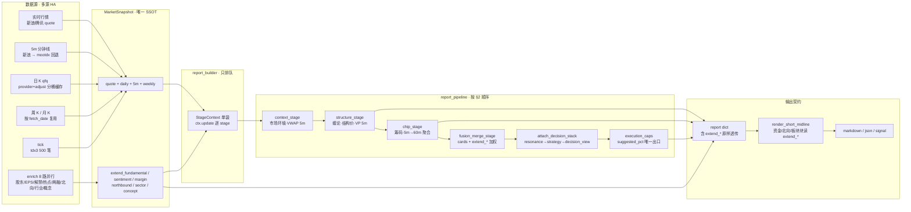

# ARCHITECTURE.md — Trader 系统架构

> **最后更新**：2026-08-02 | **基于**：`cursor/arch-cleanup-complete-1c6b`（#53 架构收口）  
> **产品方向法源**：[`docs/designs/resonance-and-orchestration.md`](docs/designs/resonance-and-orchestration.md)  
> **层边界**：[`docs/designs/analysis-strategy-boundaries.md`](docs/designs/analysis-strategy-boundaries.md)  
> **改代码地图**：[`AGENTS.md`](AGENTS.md)「改代码去哪」（**优先于本文行数表**；行数仅供扫图）  
> **业务合同**：[`BUSINESS.md`](BUSINESS.md) §2.0 双轨 / §2.7 Fusion / §4.0 阶段三字段  

冲突时：`BUSINESS.md` + resonance 法源 + `trader_shared/` 实现 > 本文。旧文「fusion 当总司令」一律过时。

---

## 1. 架构概览

采用**五层 + 编排总管**：数据 → 分析（意见卡）→ 岗位共振 / 原典策略 / 纪律 → **decision_view** → 多场景展示。  
Fusion **仅仪表**（`product_role=instrument`）；新开铁律：

```text
可推荐新开  ⇔  共振齐  ∧  主入场策略 executable  ∧  纪律允许
```

```
┌──────────────────────────────────────────────────────────────┐
│ 入口层   │ final_report / final_pool(薄) / t0 / review / wyckoff
├──────────────────────────────────────────────────────────────┤
│ 编排层   │ report_builder（只排队）+ StageContext 袋
│          │ report_pipeline/*_stage · attach_* · pool_cmds
├──────────────────────────────────────────────────────────────┤
│ 分析层   │ cores/plugins → analysis_cards（各理论各说各话）
│ 共振/策略│ resonance(pullback_probe) · strategy packs · 六闸
│ 决策/纪律│ mistery_gate / chan_discipline → merge（只收紧）
│          │ decision_view + apply_execution_caps（仓位单出口）
│ Fusion   │ 生产 cards；失败→cards_failed 中性；merge 在 stage_pack 后（A1）
├──────────────────────────────────────────────────────────────┤
│ 数据/持久│ market_types SSOT · data_provider · data_access.get_quotes
│          │ trader_paths · holdings SSOT · json_atomic 锁内 RMW
├──────────────────────────────────────────────────────────────┤
│ 展示层   │ report_renderer/short_midline · T0 结构卡 · 池面板
└──────────────────────────────────────────────────────────────┘
```

**近年关键决策**：
- ADR-001～003b：shared 库 / PluginRegistry / builder vs renderer  
- 2026-07：`report_pipeline/` 分包；t0/review/wyckoff 引擎下沉（包内 shim）  
- 2026-08：阶段字段纪律 · holdings/`trader_paths` · fusion 仪表化 · execution_caps · A1 早卡晚并  
- 2026-08-02：cards 失败=`cards_failed`（禁静默 classic）· `fusion_confidence` 中性模块 · 池价 `get_quotes`  
- 2026-08-02：classic/compare **已退役**；mappers → `_deprecated/`；`fusion_input_path` 仅 `cards`/`cards_failed` 

---

## 2. 单票编排顺序（真相）

`report_builder.build_report` **只排队**；业务在 `report_pipeline/`。现行顺序（A1）：

```text
context
  → run_pre_cards_stage          # 意见卡原料 + volume_warning（尚无 merge 分）
  → structure / chip / stage     # 不消费 fusion 分/动作改 major_stage
  → assemble_base_report(ctx)    # 骨架；写入 _fusion_pre_cards
  → attach_stage_position_pack
  → run_fusion_merge_stage       # merge_decisions + verbatim + tag instrument
  → attach_short_midline_and_decision
        · 关键价 / 纪律（可看 fusion 否决·分歧）
        · attach_decision_stack：cards → resonance → strategy → decision_view
        · apply_execution_caps   # suggested_pct / caps 唯一出口
  → render_short_midline
```

**延期（A2）**：勿把 `run_fusion_merge_stage` 挪到 `decision_view` 之后（纪律仍需在 DV 前看到否决/分歧）。

锚点：`fusion_stage.py`（`run_pre_cards_stage` / `run_fusion_merge_stage`）、`decision_view.apply_execution_caps`、`stage_context.StageContext`。

---

## 2.1 数据流图（输入 → snapshot → stage → 输出 → renderer）

> 用途：Agent 改字段/排查时**按图导航**，替代 grep 猜链路。数据 SSOT = `market_types.MarketSnapshot`；拉取入口 = `light_data.load_market_snapshot`（经 `data_provider.get_provider`）。本图是当前实现（2026-08-06）的忠实映射，非理想设计。



**关键消费矩阵**（改某字段前先查这里）：

| 数据 | 拉取处 | 消费方（决策链） | 展示方 |
|------|--------|------------------|--------|
| 日 K qfq | `light_data.fetch_qfq_daily` | structure / chip / fusion / stage_detect | 全部 |
| 5m | `fetch_5m`（新浪→mootdx） | chip（60m 聚合）· context（VWAP）· structure（VP） | 盘中参考 |
| 周 K | `fetch_weekly` | midline 缠/威 · `mid_key_prices` | 中线 |
| `extend_sector` | `_enrich_snapshot`（tushare 行业快照） | **fusion 加权** · **stage_detect** · context 市场环境 | 板块行 |
| `extend_fundamental` | 同（股东趋势） | **fusion 加权** | 资金/股东块 |
| `extend_sentiment` | 同（解禁/EPS） | **fusion 加权** | 解禁块 |
| `extend_margin` / `northbound` | 同（两融/北向） | **fusion 加权** | 两融/北向块 |

> ⚠ 因此 `TRADER_SNAPSHOT_ENRICH=0` **不能**进批量路径：extend_* 参与 fusion 加权与阶段检测，关闭会改变结论（非仅减速）。

---

## 3. 阶段三字段（禁止混读）

| 字段 | 含义 | 用途 |
|------|------|------|
| `midline_stage` / `conclusion.stage_line` | **周线威科夫**短词（吸筹/主升/派发/…；不足→无阶段） | 共振背景岗（面板不单独「阶段：」行；细读见威科夫：） |
| `major_stage` | 日线四阶段（蓄势/主升/派发/衰退） | 门控 / 池软信号；**不**写面板阶段行 |
| `short_term_momentum` | EXPMA 走强/修复/震荡/转弱 | 顶栏量能行「位置 …」 |
| `report["stage"]` | **别名** = `short_term_momentum` | 兼容旧读方；非 major、非 determine_stage |

SSOT：`stage_fields.py` · BUSINESS §4.0 · AGENTS「阶段三字段」。

---

## 4. 岗位与时框（双轨）

| 岗位 | 学说 | 时框 | 回答 |
|------|------|------|------|
| 中线状态 / 背景 | 威科夫 | **仅周线** | 阶段/能不能谈试探 |
| 短线扳机 / 结构 | 缠论 | **日线**（+30m 区间套） | 位到了没有 |
| 确认/否决 | 动量 · VPF | 日线 | 不拆台即可；不改阶段、不单独开仓 |
| 日线威科夫 | 同引擎 | 日线 | **只对照**；不进定论/fusion/背景岗 |

详见 BUSINESS §2.0–2.2。

---

## 5. trader_shared 模块图（角色，非行数真相）

### 5.1 基础设施

| 模块 | 角色 |
|------|------|
| `market_types.py` | `Security` / `MarketSnapshot` SSOT |
| `data_provider.py` / `light_data.py` | 多源行情；日 K 按 provider+adjust 分桶缓存 |
| `data_access.py` | 上层统一取数；`get_quotes` 有界并行批量快照（池价刷新） |
| `trader_paths.py` | `~/.trader`（或 `TRADER_ROOT`）命名路径注册表 |
| `json_atomic.py` | flock + tmp/fsync/replace |
| `holdings.py` | 持仓成本/股数 SSOT；`resolve_cost_price(显式>--cost>holdings>0)` |
| `data_manager.py` | 状态总线（与 paths 并存；新写优先 paths + atomic） |
| `config.py` | `CHAN_*` / `WYCKOFF_*` / fusion 开关等 |

### 5.2 分析专家

| 域 | 锚点 |
|----|------|
| 缠论 | `chan_core` / `chan_geometry` / `chan_structure` / `formulas.md` |
| 威科夫 | `wyckoff_core` / `wyckoff_events` / `wyckoff_phase` / `wyckoff_view` |
| 动量 / VPF | `momentum_core` · `vpf_core`（短线 fusion 第三席） |
| 筹码 / 结构价 | `chip_core` · `structure_core` · `key_prices` · `mid_key_prices` / `midline_structure` |
| 意见卡 | `analysis/cards.py` · `fusion_card_signals.py` |

### 5.3 共振 · 策略 · 决策

| 模块 | 角色 |
|------|------|
| `resonance.py` | `pullback_probe` 四岗；`report["resonance"]`=`resonance_v1`（MTF 在 `mtf_resonance`） |
| `strategy/match.py` + `strategy/packs/` | 六闸；entry 须 `executable=True`（文案「可扳机」） |
| `mistery_gate` / `chan_discipline` | 纪律只收紧 → `merge_discipline` |
| `decision_view.py` | 出手真相 + `apply_execution_caps` |
| `fusion_core.py` | 三席加权仪表；一律 cards；失败→`cards_failed` 中性（classic/compare 已退役） |
| `fusion_confidence.py` | 置信度 U 型映射中性模块（cards 共用；勿经 classic_mappers） |

### 5.4 报告流水线

| 模块 | 角色 |
|------|------|
| `report_builder.py` | 只排队；`StageContext` 单袋 |
| `report_pipeline/fusion_stage.py` | pre_cards / merge 拆分 |
| `structure_stage` / `chip_stage` / `assemble_stage` | 阶段函数；assemble/attach 吃 ctx |
| `attach_short_midline.py` / `attach_decision_stack.py` | 短中线 + 决策栈 |
| `conclusion_block.py` | 中线定论（阶段钉周威科夫） |
| `report_renderer/short_midline.py` | **面板文案真相** |

### 5.5 T0 / 复盘 / 池

| 域 | 引擎在 shared | 包内 |
|----|---------------|------|
| T0 | `t0_run` / `t0_core` / `t0_monitor` / `t0_account` / `t0_ledger` | identity shim |
| 复盘/仓位 | `review_*` / `portfolio_*` | shim；组合落盘双写 holdings |
| 选股池 | — | `pool_cmds/*`；`final_pool.py` 仅 CLI |

T0 的 `plan.resonance` = `t0_structure_score_v1`，**禁止**挂 `pullback_probe`。

---

## 6. 持久化（`trader_paths`）

统一根：`TRADER_ROOT` 或 `~/.trader`。新代码**禁止**再硬编码家目录路径。

| Key / 文件 | 用途 |
|------------|------|
| `signals` | Signal Contract v2（`signals.jsonl`） |
| `pool` / `pending` / `last_plan` | 选股池 |
| `holdings` | 持仓 SSOT（双写 legacy `position.json` / `positions.json`） |
| `trailing_stop_watermark` | ATR 水位（**仅真实持仓**） |
| `buy_point_lifecycle` | 买点盖失败（锁内 RMW） |
| `chip_history` / `wyckoff_phase` / `last_add_dates` | 筹码搬家 / 阶段机 / 加仓日 |
| `calibrated_params` / `signal_results` / … | 见 AGENTS 持久化表 |

写模式：`json_atomic.locked_rmw_json`（与水位同级）。

---

## 7. 依赖简图

```
final_report / skill CLI
  → report_builder.build_report
       → StageContext
       → report_pipeline stages（上节顺序）
       → decision_view + execution_caps
  → report_core.render_short_midline

fusion_core.merge_decisions  ← 仅仪表；读卡路径 analysis/
resonance / strategy_match   ← 读卡，不重跑检测
holdings.resolve_cost_price  ← 水位/持仓态
```

融合三席（仪表）：缠论 · 动量 · **VPF**（日线威科夫已退出加权）。  
`fusion_input_path`：`cards` \| `cards_failed`（见 BUSINESS §2.7；classic/compare 已退役）。

---

## 8. 插件

`PluginRegistry` 自动发现 `IndicatorPlugin` 子类。  
决策席生产以 **cards → fusion_card_signals** 为准；WyckoffPlugin 日线不进短线加权（VPF 替第三席）。展示插件（Supertrend/VWAP 等）不进出手。

---

## 9. 测试与门禁

| 类型 | 位置 | 说明 |
|------|------|------|
| 门禁子集 | `scripts/run-gate-tests.sh` | 离线；勿塞全量历史红项 |
| 合同测 | `test_stage_field_discipline` / `test_fusion_instrument_caps` / `test_holdings` / `test_trader_paths` / M2–M8… | 锁阶段/fusion/持仓/路径 |
| Golden | `tests/golden/` · `test_golden_diff_gate` | 改面板骨架须刷新 |
| 离线 seam | `testing/mock_seam.py` | 堵网络 |

说明：`docs/architecture/ci-gate.md`。

---

## 10. 扩展方式（仍适用）

1. **新理论**：`*_core` + 意见卡 builder；策略读卡，禁止在展示层重跑检测  
2. **新原典剧本**：`strategy/packs/*.yaml` + match 闸  
3. **新场景入口**：新编排 CLI，复用同一 `decision_view` / resonance 字段  
4. **改面板**：`short_midline.py` → 刷新 golden →（骨架变了再）`output-template.md`  

**禁止**：加厚 fusion 当总司令；用日线冒充中线阶段；信号 `track` 冒充持仓；纪律只收紧被改松。

---

## 11. 文档谁说了算

| 问题 | 去哪 |
|------|------|
| 岗位/时框/新开铁律 | `BUSINESS.md` §2 · resonance 法源 |
| 改哪个文件 | `AGENTS.md`「改代码去哪」 |
| 层 import 红线 | `analysis-strategy-boundaries.md` |
| 缠论公式 | `trader_shared/formulas.md` |
| 本页 | 鸟瞰 + 管线顺序；**细节以法源与代码为准** |

---

*架构变更须同步：本文管线节 + AGENTS 改代码表 + resonance 阶段表。行数表不再维护为真相。*
