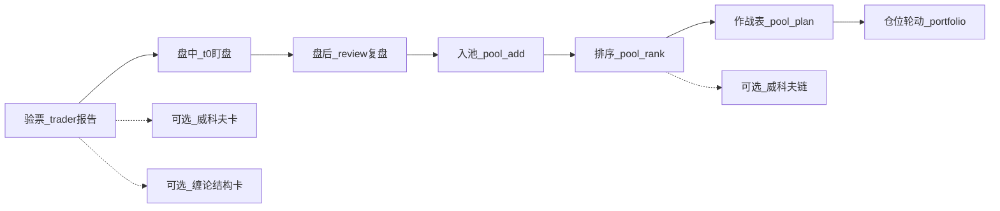

# Skill 使用指南

> 给操盘手：把五个 Skill 当五个岗位助手，按交易日节奏喊人。  
> 给 Agent / 手跑脚本：文末有命令与快路径。  
> 详细对话示例与面板样例见 [user-guide.md](./user-guide.md)。  
> 法源手递：[skill-usage-guide-chanlun-handoff.md](../plans/skill-usage-guide-chanlun-handoff.md)。

核心原则：**脚本产出是唯一真相**。不要手拼面板，不要凭阶段/动能推断方向。

---

## 一、五个助手各干什么

| 助手 | 像谁 | 什么时候喊 | 入口（仓库根） |
|------|------|------------|----------------|
| **trader** | 研究岗 / 作战参谋 | 看新票、入关注池、排明天优先级 | [`final_report.py`](../../01-功能包-packages/trader/scripts/final_report.py) / [`final_pool.py`](../../01-功能包-packages/trader/scripts/final_pool.py) |
| **t0** | 盘中盯盘员 | 开盘后看结构、找节奏（不替你下单） | [`final_t0.py`](../../01-功能包-packages/t0/scripts/final_t0.py) |
| **review** | 盘后复盘教练 | 收盘复盘、几只票怎么轮、决策体检 | [`final_review.py`](../../01-功能包-packages/review/scripts/final_review.py) / [`final_portfolio.py`](../../01-功能包-packages/review/scripts/final_portfolio.py) / [`final_tracker.py`](../../01-功能包-packages/review/scripts/final_tracker.py) |
| **wyckoff** | 主力行为翻译官 | 搞不清吸筹/派发时单独问（参考岗） | [`final_wyckoff.py`](../../01-功能包-packages/wyckoff/scripts/final_wyckoff.py) |
| **chanlun** | 缠论结构学术卡 | 搞不清笔/段/中枢或一二三买依据时单独问（参考岗） | [`final_chanlun.py`](../../01-功能包-packages/chanlun/scripts/final_chanlun.py) |

一句话分工：

- **要不要盯、怎么排优先级** → trader  
- **盘中现在什么结构** → t0  
- **今天做对了没有、仓位怎么挪** → review  
- **主力大概在哪一段** → wyckoff（不当总司令）  
- **笔方向 / 买卖点依据是什么** → chanlun（结构学术卡；不下单；**不覆盖**周线威科夫中线阶段）

另有 [`daily_briefing`](../../01-功能包-packages/daily_briefing/SKILL.md)（候选池日简报），不在主 Skill 表里；日常以五个主 Skill 为准。

### 1.1 chanlun 关心什么（核对用）

专项卡围着四条转；缺一条别当「看懂了」：

| # | 关心点 | 要核对 |
|---|--------|--------|
| 1 | **取数** | 日/周 OHLCV 是否同源复权、根数够成笔；缺数要诚实报不足 |
| 2 | **期限** | 短线看日线笔；中线缠论副读看周线（周不足日线 fallback 须标「（日线）」）；禁止日线笔冒充中线定论 |
| 3 | **一二三买** | **只跟引擎**已判定的买卖点；禁止手补「接近一买」 |
| 4 | **笔方向** | 当前笔向上/向下、笔数、近笔序列与引擎一致 |

展开合同与验收见 [`chanlun-skill-playbook.md`](../plans/chanlun-skill-playbook.md)、[`chanlun-skill-deep-card-handoff.md`](../plans/chanlun-skill-deep-card-handoff.md)。  
买不买仍以 trader 报告里的 `decision_view` 出手结论为准——chanlun / wyckoff **都不当总司令**。

---

## 二、一天怎么用（推荐节奏）



固定流程（操盘手版）：

```text
看到新票 → 验票（trader）
觉得顺眼 → 入池
每晚/盘前 → 作战表（明天盯谁）
盘中 → 对重点票开 t0
收盘 → review 复盘
搞不清吸筹/派发 → wyckoff 补一眼（不当总司令）
搞不清笔/买卖点依据 → chanlun 补一眼（不当总司令）
周末偶尔 → 决策体检 / 仓位轮动
```

### 2.1 盘前 / 晚上：先定明天盯谁

1. 「分析一下 XX」→ 短中线报告  
2. 觉得值得跟 →「加入选股池」  
3. 池子多了 →「排一下池子 / 出明日作战表」

这步解决的是**明天注意力放哪几只**，不是马上买。

### 2.2 开盘后：只盯作战表里的票

「盯一下 XX」（可加成本/仓位）。

t0 是**盘中结构仪表盘**：位置、节奏、风险提示。  
正确用法：对照盘口，自己决定做不做。  
错误用法：读成「现在可以低吸 / 三重共振买」。

没有底仓时别硬聊 T；破位日、数据不足日也别逼着做。

### 2.3 收盘后：复盘纠偏

- 单票：「复盘一下 XX」  
- 几只一起拿着：「这几只怎么轮动」  
- 隔一阵：「体检一下最近决策」

### 2.4 看不懂阶段 / 结构：再叫参考岗

- 吸筹 / 派发拿不准 →「威科夫看下 XX」／「池子吸筹链排一下」→ wyckoff  
- 笔、段、中枢或一二三买依据拿不准 →「缠论结构看下 XX」→ chanlun  

二者都是**结构参考卡**，不开仓、不下单指令；中线阶段定论仍以 trader 报告里的周线威科夫为准。  
买不买仍以 trader 报告里的出手结论为准。

---

## 三、怎么对 Agent 说话

| 你想做的事 | 可以这样说 |
|------------|------------|
| 单票验票 | 「分析一下贵州茅台 / 600519」 |
| 盘中结构 | 「帮我盯一下这只」 |
| 盘后复盘 | 「盘后复盘 XX」 |
| 入池 / 作战表 | 「加入选股池」/「排出明日作战表」 |
| 威科夫 | 「威科夫结构」/「池子吸筹链」 |
| 缠论结构卡 | 「缠论结构看下 XX」/「笔和买卖点依据」 |
| 仓位轮动 | 「这几只怎么轮动」 |

票名未说清、或空问「该不该买」时，应先问清标的，再跑脚本。

首次用 T0 且没有持仓成本时，先补成本/仓位再盯盘（见 `holdings` / legacy `position.json`）。

---

## 四、怎么读产出（避免误用）

拿到单票报告，只抓三件事：

1. **中线**：大方向能不能拿、关键价在哪  
2. **短线**：近期能不能碰、纪律允不允许动手  
3. **出手结论**：能不能新开 / 该不该收紧——不要被综合分唬住  

契约要点：

- 主契约始终是**中短线双轨**（`🧭 中线` + `⚡ 短线`），不是旧的 `🎯` + `📍 决策`。  
- **方向/出手**看 `decision_view`（共振 ∧ 策略 ∧ 纪律）；`fusion.weighted_score` 只是仪表。  
- 纪律只收紧，不改阶段分、支撑、止损。  
- T0 禁止「可执行 / 可低吸 / 三重共振买」这类指令叙事。  
- 威科夫 `rank` 是吸筹链参考，**不等于** trader 池分道（可盯/等齐/先别碰）。  
- chanlun 是结构学术卡：只核对取数 / 期限 / 引擎买卖点 / 笔方向；**禁止**读成「宜买」。  
- 推微信时遵守红线：禁 `#`、`---`、`**`、`|` 表格、`>`、`*/-` 列表；用 emoji 分节行。详见 [`_common/agent-rules.md`](../../01-功能包-packages/_common/agent-rules.md)。

三条红线：

1. **没跑分析，不拍板**  
2. **脚本出什么贴什么**——别让 AI 再「润色成买入建议」  
3. **岗位别串戏**——t0 不定方向；wyckoff / chanlun 不开仓；作战表不是「明天必买清单」

---

## 五、命令速查（仓库根）

在 Skill 包内把路径换成 `python3 scripts/<同名入口>.py ...`。

```bash
# 1) 新票验票
python3 01-功能包-packages/trader/scripts/final_report.py --target <NAME> --output markdown

# 2) 盘中结构 / 盯盘
python3 01-功能包-packages/t0/scripts/final_t0.py --target <NAME>
python3 01-功能包-packages/t0/scripts/final_t0.py --target <NAME> --monitor --once

# 3) 盘后复盘
python3 01-功能包-packages/review/scripts/final_review.py --target <NAME>

# 4) 入池 → 排序 → 明日作战表
python3 01-功能包-packages/trader/scripts/final_pool.py add --target <NAME>
python3 01-功能包-packages/trader/scripts/final_pool.py rank
python3 01-功能包-packages/trader/scripts/final_pool.py plan

# 5) 仓位轮动 / 信号体检
python3 01-功能包-packages/review/scripts/final_portfolio.py --targets A B
python3 01-功能包-packages/review/scripts/final_tracker.py checkup --days 90

# 6) 威科夫（可选参考；不当总司令）
python3 01-功能包-packages/wyckoff/scripts/final_wyckoff.py --target <NAME>
python3 01-功能包-packages/wyckoff/scripts/final_wyckoff.py rank

# 7) 缠论结构卡（可选参考；不当总司令；不下单）
python3 01-功能包-packages/chanlun/scripts/final_chanlun.py --target <NAME>
```

仓位轮动在 **review** 包（无独立 `portfolio/` 包）。

---

## 六、Agent 快路径

1. 先扫 [`AGENTS.md`](../../AGENTS.md) 红线摘要。  
2. 只预读该 Skill 的 `references/agent-quickstart.md` + 共用 [`_common/agent-rules.md`](../../01-功能包-packages/_common/agent-rules.md)。  
3. **跑脚本 → 原样贴 stdout → 停**。  
4. 禁止：开工前批量读 references；默认 `--output json`；未跑脚本就给行情/出手结论；改写或手拼 Markdown。

JSON 仅在 markdown 失败或确实需要额外字段时再用。

---

## 七、状态落在哪

| 文件 | 用途 |
|------|------|
| `~/.trader/pool.json` / `pending.json` / `last_plan.json` | 选股池与作战表 |
| `~/.trader/signals.jsonl` | 信号事件流 |
| `~/.trader/holdings.json` | 持仓成本/股数（legacy 亦见 `position.json`） |
| `~/.t0-trader/state.json` / `~/.review-trader/state.json` | Skill 缓存 |

---

## 八、开发者补充（改实现时）

引擎真相在 [`02-共享模块-shared/trader_shared/`](../../02-共享模块-shared/trader_shared/)；Skill 包内同名脚本多为 shim。  
改输出：`short_midline.py` → 刷新 golden → 骨架变了再动 `output-template.md`。  
验证：`scripts/run-gate-tests.sh`。  
改代码地图见 [`AGENTS.md`](../../AGENTS.md)。

---

一句话总结：

**晚上用 trader 排战场，白天用 t0 看结构，收盘用 review 纠偏；吸筹/派发问 wyckoff，笔/买卖点依据问 chanlun——后两者都不当总司令。**
